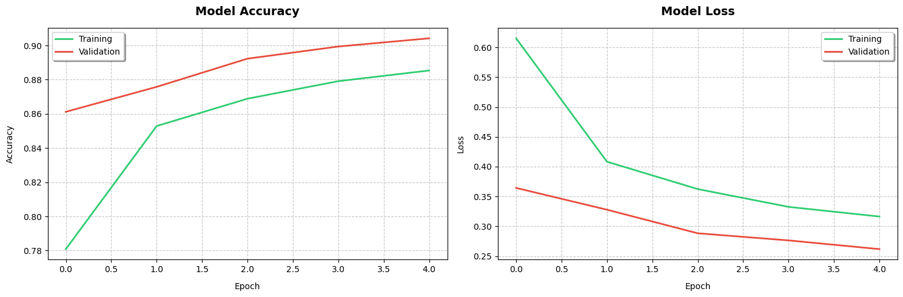

# Fashion Item Classifier

A web application that classifies fashion items using a deep learning model trained on the Fashion MNIST dataset. The application is built with Streamlit and TensorFlow.

## Overview

This project implements a Convolutional Neural Network (CNN) to classify fashion items into 10 different categories:

- T-shirt/top
- Trouser
- Pullover
- Dress
- Coat
- Sandal
- Shirt
- Sneaker
- Bag
- Ankle boot

## Tech Stack

- Python 3.10
- TensorFlow 2.x
- Streamlit
- PIL (Python Imaging Library)
- NumPy
- Docker

## Quick Start

1. Install dependencies:
```sh
pip install -r requirements.txt
```

2. Run the application:
```sh
streamlit run main.py
```

3. If using Docker: 
```sh
docker build -t fashion-classifier .
docker run -p 80:80 fashion-classifier
```

## Model Performance

The trained model achieves good performance on the Fashion MNIST dataset. Here are the model metrics:

### Training Results

*Model accuracy and loss during training*

### Model Evaluation

*Confusion matrix showing model performance across classes*

### Sample Predictions

*Example classifications from the test dataset*

## Usage

1. Open the web interface
2. Upload an image of a fashion item (supported formats: JPG, JPEG, PNG)
3. Click "Classify" to get the prediction
4. The model will display the predicted class and confidence score

## Project Structure

```
fashion-classifier/
├── main.py                         # Streamlit web application
├── class_model.keras              # Trained model weights
├── requirements.txt               # Project dependencies
├── Dockerfile                     # Container configuration
├── Fashion_MNIST_model_training.ipynb  # Model training notebook
└── images/                        # Model performance visualizations
    ├── training_results.png
    ├── confusion_matrix.png
    └── sample_predictions.png
```

## Model Architecture

The CNN model consists of:
- 3 Convolutional layers (32, 64, 64 filters)
- Batch normalization after each conv layer
- MaxPooling and Dropout for regularization
- Dense layers (128 units, 10 output classes)
- Softmax activation for classification

## Contributing

Feel free to open issues and pull requests for improvements.

## License

MIT License

